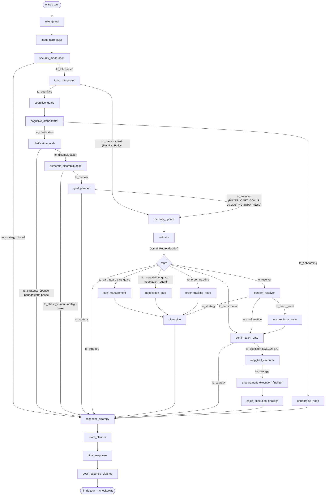

# MARKET COACH — CARTOGRAPHIE COMPLÈTE

_Généré le 2026-09-08 par lecture exhaustive de `backend/src/agriconnect/graphs/agents/market_coach/` (~130 fichiers, ~35 000 lignes). Objectif : donner une vue précise et vérifiée du fonctionnement réel de l'agent — pas une doc aspirationnelle — pour accélérer le diagnostic des bugs récurrents._

---

## 0. Comment lire ce document

Chaque section cite les fichiers réels (`chemin/fichier.py:ligne` quand pertinent). Les « pièges connus » listés ne sont pas des suppositions : ce sont des commentaires d'incident déjà présents dans le code (dates, causes racines, correctifs) — la base de code documente elle-même son histoire de bugs de façon inhabituellement précise. La [section 12](#12-catalogue-des-classes-de-bugs-récurrentes) consolide cette histoire en un guide de diagnostic.

---

## 1. Vue d'ensemble

`market_coach` est un agent conversationnel WhatsApp (LangGraph `StateGraph`) qui sert **à la fois** les producteurs et les acheteurs de la marketplace agricole AgriConnect — **un seul graphe compilé**, pas un par rôle (refonte double-rôle, 2026-09-02+) : n'importe quel utilisateur peut vendre ET acheter dans la même conversation, le domaine (BUYER/PRODUCER) étant résolu **par goal**, jamais par une session figée.

```
Entrée WhatsApp (Twilio) → orchestrator (hors market_coach) → build_graph(role, ...) → StateGraph.ainvoke(state)
→ 14+ nœuds séquentiels/conditionnels → final_response → WorkspaceCheckpointer (persistance) → réponse WhatsApp
```

Point d'entrée module : [`adapter.py`](../src/agriconnect/graphs/agents/market_coach/adapter.py) (`MarketCoach.handle()` / `get_agent_graph()`), mais le graphe lui-même est assemblé par [`core/graph_builder.py::build_graph()`](../src/agriconnect/graphs/agents/market_coach/core/graph_builder.py:191).

---

## 2. Le graphe LangGraph — topologie complète

Source de vérité : `core/graph_builder.py`. 25 nœuds enregistrés, edges (fixes + conditionnels) ci-dessous.



### Table des nœuds (fichier, rôle en une ligne)

| # | Nœud | Fichier | Rôle |
|---|---|---|---|
| 1 | `role_guard` | `nodes/role_guard.py` | Renseigne `user_role` par défaut (2026-09-08 : ne pose plus le doublon `role`, voir addendum en fin de document). Depuis la refonte double-rôle : **plus un contrôle d'accès**, juste une valeur d'affichage. |
| 2 | `input_normalizer` | `nodes/input_normalizer.py` | Normalise le texte, durcit contre l'injection de prompt, charge le profil utilisateur (MCP), déclenche l'onboarding si nouvel utilisateur, transcrit l'audio. |
| 3 | `security_moderation` | `nodes/security_moderation.py` | Gate compte bloqué/banni + détection produit interdit (termes cachés en cache 300s côté client). |
| 4 | `input_interpreter` | `interpreter/routing.py::make_input_interpreter` | LLM (via LLM Gateway) + ~15 fast-paths déterministes. Produit `interpreted_event`/`detected_intent`/`extracted_entities` — **converti systématiquement** via `InterpreterResult` avant de devenir un patch d'état (aucun `UNKNOWN` sans `unknown_reason`). |
| 5 | `cognitive_guard` | `nodes/cognitive.py` | Détecte interruption (`NEW_TASK` pendant un tunnel actif), gère le compteur d'échecs `retry_count` (abandon après 2 `UNKNOWN` consécutifs dans un tunnel), calcule `conversation_progress`. |
| 6 | `cognitive_orchestrator` | `nodes/cognitive.py` | Machine "perceive/think/decide/act/observe/reason" — décide `next_step` (continue/replan/clarify/respond), route vers onboarding si actif. |
| 7 | `clarification_node` | `nodes/clarification.py` | Pass-through silencieux SAUF `OUT_OF_SCOPE`/`UNKNOWN`/`REJECT` sans tunnel → réponse pédagogique LLM. **Depuis 2026-09-05** : court-circuite (zéro appel LLM) si `unknown_reason=="TECHNICAL_FAILURE"`. |
| 8 | `semantic_disambiguation` | `nodes/semantic_disambiguation.py` | Menu de désambiguïsation LEXICAL (table `INTENT_DISAMBIGUATION`), **seulement si le LLM n'a pas tranché** (confiance < 0.85 ou intent UNKNOWN) — jamais superposé à une classification LLM confiante. |
| 9 | `goal_planner` | `interpreter/goal_planner.py` | Machine à états déterministe du cycle de vie de `current_goal`/`goal_stack`/`suspended_goal` — **seul écrivain autorisé** de ces 3 clés (règle de conception de `core/state.py`). |
| 10 | `memory_update` | `nodes/memory.py` | Fusionne `extracted_entities` → `transaction_payload`, résout les sélections AG-UI (`available_mapping`), hérite les entités stables, applique les garde-fous anti-hallucination (§ modèle dégradé). **Le fichier le plus dense en correctifs d'incidents réels du repo.** |
| 11 | `validator` | `nodes/validation.py` | Vérifie la complétude vs `INTENT_CONFIG.required`, valide les contraintes de valeur (Pydantic `CONTRACTS`), gère les résolveurs passthrough (IDs techniques jamais demandés à l'utilisateur). |
| 12 | `context_resolver` | wrapper inline sur `DomainRouter.resolve()` | Délègue à `buyer_context_resolver` (`flows/buyer/flow.py`) ou `producer_context_resolver` (`flows/producer/flow.py`) selon `_goal_domain(state)`. |
| 13 | `ui_engine` | `nodes/ui_engine.py` | Convertit un `MenuRequest` (`pending_menu`) en `ag_ui_component` + `available_mapping` + snapshot Redis-like (`menu_snapshot_store`). Pass-through si pas de menu. |
| 14 | `ensure_farm_node` | `flows/producer/farm_logic.py` | Auto-provisionne/sélectionne `farm_id` pour les goals `FARM_CRITICAL_GOALS`. |
| 15 | `confirmation_gate` | `nodes/confirmation_gate.py` | LE point HITL unique avant écriture. Deux mécanismes coexistent : (a) générique `transaction_payload`/`confirmation_summary` (b) **drafts canoniques versionnés** pour `PROCUREMENT_CREATE_REQUEST`/`SALES_PUBLISH_PRODUCT` (voir §9). |
| 16 | `mcp_tool_executor` | `nodes/executor.py` | Dispatch registry → domain service → outil MCP réel. Auto-provisioning ferme, retry transitoire (2×), auto-réparation d'arguments manquants, historique borné. |
| 17 | `procurement_execution_finalizer` | `flows/buyer/procurement_execution_finalizer.py` | No-op sauf `PROCUREMENT_CREATE_REQUEST` — transitionne `ProcurementDraft` EXECUTING→EXECUTED/FAILED/EXECUTION_UNKNOWN. |
| 18 | `sales_execution_finalizer` | `flows/producer/sales_execution_finalizer.py` | Équivalent pour `SalesPublishDraft` (`SALES_PUBLISH_PRODUCT`). |
| 19 | `response_strategy` | `interpreter/strategy.py` | Routeur AG-UI déterministe — décide LA stratégie finale (`SUCCESS`/`ERROR`/`CONFIRMATION`/`ASK_MISSING_FIELD`/`SELECTION_MENU`/`CLARIFICATION`/`RECOVERY`/`INTERRUPTION_HANDLER`/`ONBOARDING`) à partir d'un ordre de priorité strict. |
| 20 | `state_cleaner` | `nodes/cleaner.py` | Purge fin-de-tour AVANT rendu (`transaction_payload` si goal terminé, `working_memory` éphémère). Ne touche jamais aux champs de réponse. |
| 21 | `final_response` | `nodes/response_handlers.py` → `nodes/rendering/*.py` | Dispatcher de rendu par stratégie (6 modules, voir §7.15). |
| 22 | `post_response_cleanup` | `nodes/cleanup.py` | Dernier nœud — reset des champs EPHEMERAL selon `pending_interaction.kind` (préserve `current_goal`/`retry_count`/confirmation si un canal reste actif). **Ne touche JAMAIS** `final_response`/`ag_ui_component`/`response_strategy` (l'orchestrateur les lit sur CET état). |
| 23-25 | `cart_management` / `negotiation_gate` / `order_tracking_node` | `flows/buyer/{cart,negotiation,order_tracking}.py` | Tunnels acheteur auto-suffisants, TOUJOURS présents dans le graphe (double-rôle) — gèrent leur propre confirmation, contournent `confirmation_gate`/`mcp_tool_executor` génériques. |
| — | `onboarding_node` | `flows/common/onboarding.py` | Bridge vers la machine à états d'inscription unifiée. |

### Nœuds « auto-suffisants » qui **contournent** `confirmation_gate`/`mcp_tool_executor`

Liste fermée, à connaître pour ne pas chercher une confirmation qui n'existe pas côté générique :
- `cart_management`, `negotiation_gate`, `order_tracking_node` (tunnels buyer — `core/goals.py`)
- `producer_auction_resolver` (`flows/producer/auctions.py`) — bidding/enchères producteur, machine à états dans `working_memory.bid_phase`
- Mise à jour catalogue/production (`flows/producer/flow.py::_resolve_product_for_update`/`_resolve_cycle_for_update`) — `working_memory.update_phase`
- Escrow producteur (`_resolve_delivery_otp`) — extraction déterministe du code, jamais de LLM

Ces mini-machines à états vivent **exclusivement dans `working_memory`** — c'est pourquoi `cognitive_guard`'s `abandon_tunnel_max_retries` doit explicitement les réinitialiser (`bid_phase`, `update_phase`, `winner_gps_stage`, `preorder_workflow.gps_stage`...) : elles ne sont jamais nettoyées par le reset générique de `current_goal`.

---

## 3. Le contrat d'état — `MarketAgentState`

Source unique : [`core/state.py`](../src/agriconnect/graphs/agents/market_coach/core/state.py) (hérite de `BuyerContext` + `ProducerContext`). ~90 champs, chacun `Annotated[Type, reducer]` :

- **`replace_value`** : la nouvelle valeur écrase l'ancienne (y compris `None` — un reset explicite).
- **`replace_list`** : remplacement intégral, jamais d'accumulation silencieuse.
- **`merge_dict`** : fusion shallow — **piège n°1 du repo** : un `{}` vide est un **NO-OP** sous `merge_dict` (préserve l'ancienne valeur !). Pour vraiment vider un champ `merge_dict`, il faut le sentinel `{"__reset__": True}`. Des bugs réels et documentés viennent d'avoir écrit `{}` en pensant vider (voir §12).

### Classification du cycle de vie — `core/state_profile.py`

Chaque champ est classé `DURABLE` / `EPHEMERAL` / `DERIVED` — **3 registres séparés doivent rester synchronisés** pour qu'un champ survive réellement d'un tour à l'autre :
1. Le reducer `Annotated[...]` dans `core/state.py` (accepte l'écriture)
2. `BuyerContext`/`ProducerContext` (déclare le champ dans le state graph)
3. `core/state_profile.py::_FIELDS` (dit au cleaner s'il faut le préserver)

Un champ multi-tour qui manque à UN SEUL de ces 3 registres ne survit pas — bug déjà vécu deux fois (`vendor_selection_context`, puis `tier_selection_context`, voir le commentaire à `state_profile.py:199`).

`DURABLE` = survit nativement (identité, `current_goal`, `pending_interaction`, `procurement_draft`/`preorder_draft`, paniers, cache fermes). `EPHEMERAL` = remis à zéro par `state_cleaner`/`post_response_cleanup` en fin de tour (résultat LLM du tour, flags de sécurité, réponse rendue). `DERIVED` = recalculé chaque tour (`missing_fields`, `validation_errors`...).

### Champs les plus sensibles à connaître

| Champ | Lifecycle | Piège |
|---|---|---|
| `pending_interaction` | DURABLE | Source **canonique unique** de « qu'attend-on de l'utilisateur ce tour ? » (voir §4) |
| `current_goal` | EPHEMERAL nominal, mais **préservé conditionnellement** par `post_response_cleanup` si un tunnel/confirmation/champ est en attente (`_keep_goal_channel`) | Sans préservation, le tour suivant repart avec `goal=None` en pleine confirmation |
| `transaction_payload` | DURABLE, `merge_dict` | Purgé explicitement (`{"__reset__": True}`) par `state_cleaner` quand le goal se termine (COMPLETED/FAILED/ERROR) |
| `procurement_draft` / `preorder_draft` | DURABLE, `replace_value` | Version ENTIÈRE remplacée à chaque mutation — jamais de fusion partielle (voir §9) |
| `retry_count` | EPHEMERAL mais suit `current_goal` (préservé tant que le tunnel vit) | A été **du code mort** un temps réel (2026-08-19) — jamais incrémenté + toujours remis à 0 → seuil d'abandon inatteignable |
| `unknown_reason` | EPHEMERAL | Distingue POURQUOI `interpreted_event=="UNKNOWN"` (`AMBIGUOUS`/`TECHNICAL_FAILURE`/...) — consommé par `clarification_node` et `nodes/rendering/ask.py` pour éviter de mentir sur la cause |

---

## 4. Le moteur d'expectation — `PendingInteraction`

**Fichier central pour tout bug de type « l'agent répond à côté »** : [`core/pending_interaction.py`](../src/agriconnect/graphs/agents/market_coach/core/pending_interaction.py).

Avant cette refonte (2026-09-02), 6 signaux concurrents encodaient la même notion (« qu'attend-on de l'utilisateur ce tour ? ») sans registre unique — cause directe d'un bug réel classique : une réponse à un menu de paliers actif classée `UNKNOWN` par l'interprète retombait sur un `expected_input=="CONFIRMATION"` PÉRIMÉ d'un tour précédent.

### `InteractionKind` (11 valeurs)
`NONE`, `SELECT_PRODUCER`, `SELECT_PRICING_TIER`, `ENTER_PACKAGE_COUNT`, `ENTER_QUANTITY` (les 4 précédents = `CART_TUNNEL_KINDS`), `ENTER_FIELD`, `CONFIRM_ACTION`, `PROVIDE_LOCATION`, `CLARIFY_INTENT`, `SELECTION_MENU`, `VERIFY_OTP`.

### `get_pending_interaction(state)` — résolveur canonique, priorité stricte
1. **Tunnel panier** (`SELECT_PRODUCER`/`SELECT_PRICING_TIER`/`ENTER_PACKAGE_COUNT`/`ENTER_QUANTITY`) — **jamais lu depuis un champ persisté**, toujours reconstruit à neuf via `domain/selection_actions.py::build_selection_context(state)` depuis `vendor_selection_context`/`tier_selection_context`. Ne peut donc jamais être périmé.
2. `state["pending_interaction"]` (persisté, DURABLE) — écrit exclusivement par `confirmation_gate`, `gps_delivery_gate`, `validator`, `clarification_node`, `semantic_disambiguation`, `ui_engine`.
3. `legacy_confirmation_bridge()` — pont borné dans le temps pour les checkpoints Postgres pré-2026-09-02.
4. `NONE`.

### `to_tunnel_category(pending)` — traduit vers le vocabulaire `expected_input` legacy (`PRODUCT`/`PRICE`/`QUANTITY`/`SELECTION`/`CONFIRMATION`/`LOCATION`/`OTP_CODE`/`NONE`...) consommé par `TunnelManager`, `response_strategy`, les renderers.

### Invariants vérifiés (`check_invariants`, non bloquant — log seulement)
- `CONFIRM_ACTION` doit avoir un `confirmation_summary`/`transaction_payload` cohérent.
- Un tunnel panier actif doit référencer un contexte réellement vivant (pas `__reset__`).

**Écrivain unique par kind** : `confirmation_gate` = seul écrivain de `CONFIRM_ACTION` ; `ui_engine`/`semantic_disambiguation` = `SELECTION_MENU` ; `validator` = `ENTER_FIELD`. Ne jamais poser un `pending_interaction` depuis un autre nœud sans vérifier qu'on n'écrase pas cette règle.

---

## 5. Le catalogue d'intentions — `interpreter/intent.py`

**Fichier de configuration le plus important du repo** (1405 lignes) — `INTENT_CONFIG` : ~60 intents, chacun avec `tool_name`, `required` (champs bloquants), `action_type` (READ/WRITE), `requires_farm`, `label`/`label_map`, `handled_by_flow` (contourne le pipeline générique), `tunnel`/`breakout` (assignés en bloc, dérivés vers `core/goals.py` — **jamais** recopier un frozenset de goals à la main ailleurs, un vrai bug de dérive a existé : `MARKET_MY_REQUESTS` absent d'une copie locale de `core/router.py`).

`INTENT_ROLE` : PRODUCER/BUYER/BOTH par intent — source unique pour filtrer les intents autorisés par rôle (`allowed_intents_for_role`, `interpreter/routing.py`).

`INTENT_DISAMBIGUATION` : table des menus de désambiguïsation lexicale (STOCK_OR_SALES_DECLARATION, SELLER_HUB, BUY_VS_BROWSE, MARKET_PRICE_LOOKUP, RESUME_TUNNEL, ORDER_TRACKING_INTENT, AUCTION_TRACKING_INTENT) — consommée par `semantic_disambiguation.py`, **seulement si le LLM ne tranche pas** (§7.4).

Deux validations `_validate_goal_drift()`/`validate_config_drift()` (dans `core/goals.py`/`core/base.py`) échouent fort **à l'import** si le catalogue diverge du registre d'actions ou des ensembles de goals dérivés — la dérive de configuration est structurellement détectée avant la prod, pas en observant un symptôme.

**Pour ajouter un nouveau goal métier** : (1) l'ajouter à `INTENT_CONFIG` + `INTENT_ROLE`, (2) l'enregistrer dans `registry.py` (`@register_action`) OU le marquer `handled_by_flow=True` s'il a son propre flow dédié, (3) l'assigner à un `tunnel` dans `_TUNNEL_ASSIGNMENTS` si applicable, (4) créer son handler dans `actions/<domaine>.py` + DTO Pydantic dans `actions/<domaine>_dto.py` si dispatch générique.

---

## 6. Routing & tunnels

Trois mécanismes complémentaires, à ne pas confondre :

### 6.1 `core/policies.py::FastPathPolicy`
Bypass de la chaîne cognitive (5 nœuds) après `input_interpreter` — **seulement** pour BUYER, événement `ANSWER`/`SELECTION` sur un goal de `ALL_BUYER_TUNNEL_GOALS` → direct vers `memory_update` (`to_memory_fast`). Économie de latence pure, aucune logique métier.

### 6.2 `core/tunnel_manager.py::TunnelManager`
Décide si un événement entrant doit être absorbé par le tunnel actif ou l'interrompre. Slots "durs" (`CONFIRMATION`, `OTP`) vs "mous" (`PRODUCT`/`PRICE`/`QUANTITY`/... — dérivés de `core/slots.py::SLOT_FILLING_INPUTS`, **jamais recopiés à la main** — 3 copies avaient dérivé avant cette centralisation). `OTP`/`OTP_CODE` sont **jamais** interruptibles, même par un intent critique. Un intent `breakout` (`INTENT_CONFIG[...]["breakout"]=True`) casse même un slot dur.

### 6.3 `core/router.py::DomainRouter`
Fusion de deux anciens rôles : `decide()` (routage post-validator, règles `RouteRule` avec garde optionnel) + `resolve()` (délègue à `buyer_context_resolver`/`producer_context_resolver` selon `_goal_domain(state)`, dérivé de `INTENT_ROLE`). Règles dans `DomainRouter.build()` : panier (garde `_cart_guard` — laisse toujours passer un tunnel de sélection actif, même avec des `missing_fields`), négociation (garde `_negotiation_guard`), tracking commandes/enchères, preorder/producer_resolver/producer_update/producer_escrow → `to_resolver`.

### 6.4 `interpreter/strategy.py::response_strategy`
Le routeur final AG-UI — décide la stratégie de rendu affichée à l'utilisateur, dans un ordre de priorité **strict et non négociable** :
1. Sécurité (`SCAM_DETECTED`) / interruption détectée
2. `REJECT` explicite
3. Tunnel panier encore actif (`CART_TUNNEL_KINDS`) — **gagne toujours**, même sur un `expected_input=="CONFIRMATION"` périmé
4. Décision `cognitive_guard` (`recover_active_tunnel`/`abandon_tunnel_max_retries`)
5. `UNKNOWN`/`OUT_OF_SCOPE` (sauf `location_shared`) → menu/champ/confirmation/clarification selon `expected_input`
6. `missing_fields` non vides
7. Stratégie déjà posée en amont (respectée telle quelle)
8. Statuts terminaux (`BLOCKED`/`ERROR`/`COMPLETED`/`WAITING_CONFIRMATION`/`WAITING_INPUT`)
9. Repli `CLARIFICATION`

---

## 7. Le package `interpreter/` en détail

| Fichier | Rôle |
|---|---|
| `intent.py` | Catalogue `INTENT_CONFIG`/`INTENT_ROLE`/`INTENT_DOMAIN`/`INTENT_DISAMBIGUATION` (§5) |
| `routing.py` (1927 lignes) | `make_input_interpreter(role)` — ~15 fast-paths déterministes (index numérique, mots-clés de confirmation, réponse composée quantité+prix par regex...) **avant** tout appel LLM ; sinon prompt dynamique + appel `llm_gateway.complete()` ; `_degraded_fallback` (repli lexical minimal si LLM HS, **BUYER only**, un seul pattern reconnu) ; conversion finale obligatoire via `InterpreterResult` |
| `goal_planner.py` (746 lignes) | Machine à états déterministe — seul propriétaire de `current_goal`/`goal_stack`/`suspended_goal` |
| `contracts.py` | Contrats Pydantic post-LLM (`AddToCartContract`, `NegotiationContract`, `PublishProductContract`...) — défense en profondeur, valide les VALEURS après extraction |
| `entities.py` | Normalisation d'entités — remap de clés, synonymes d'unités |
| `interpreter_result.py` | `InterpreterResult`/`UnknownReason` — point de conversion UNIQUE (§ voir aussi le rapport LLM Gateway) |
| `strategy.py` | `response_strategy` (§6.4) |
| `prompts.py` | Prompts système du LLM interpréteur |

### Fast-paths déterministes connus dans `routing.py` (liste vivante, pas exhaustive — beaucoup ont été **retirés** au fil du temps, voir commentaires "Ex-Fast-path N SUPPRIMÉ")
- Index numérique pur sur un menu actif → `SELECTION`
- Mot-clé de confirmation figé
- Réponse composée quantité+prix par regex (`fast_path_slot_numeric_compound_answer`) — seul chemin "de confiance" exempté du garde-fou anti-hallucination modèle dégradé (§12)
- Bypass interactif zéro-token (clic bouton WhatsApp)

**Principe explicite du repo** (voir mémoire `llm-decides-not-frozen-french-lists`) : ne JAMAIS ajouter une liste de mots-clés figés qui pré-empte la classification LLM en fonctionnement normal — plusieurs fast-paths lexicaux ont été **délibérément supprimés** pour cette raison (ex-fast-path RESUME, ex-fast-path buyer procurement tracking "suivre mes appels d'offres"/"voir mes enchères" — remplacé par une classification LLM instruite via `INTENT_CONFIG`). Un fast-path lexical n'est légitime que pour du **structurel** (index de menu) ou en **repli explicite panne LLM**.

---

## 8. LLM Gateway

Documenté en détail dans [`LLM_GATEWAY_FAILURE_RECOVERY_2026-09-05.md`](LLM_GATEWAY_FAILURE_RECOVERY_2026-09-05.md) (même session). Résumé pour cette cartographie :

- Point d'entrée unique : `mc_runtime.llm_gateway.complete(profile=mc_runtime.profile_answer, messages=..., response_format=...)` — jamais un nom de modèle en dur dans un nœud métier.
- `llm_router.py::get_profile_for_goal()` : FAST (nœuds d'infra — normalisation/modération/nettoyage) vs REASONING (tout le reste).
- Chaîne de repli multi-provider (`groq`/`bedrock_gateway`/`bedrock_native`) avec disjoncteur partagé Redis (`llm_gateway/circuit_breaker.py`, `health_registry.py`), pré-check de disponibilité (`availability.py`), classification d'erreur (TRANSIENT/CONFIG/APPLICATION).
- `LLMGatewayExhausted` → `unknown_reason="TECHNICAL_FAILURE"` → consommé par `clarification_node` (zéro second appel gaspillé) et `nodes/rendering/ask.py` (message honnête au lieu d'un mensonge d'accusé-réception).
- Tests : `tests/unit/llm_gateway/`, `tests/integration/test_llm_gateway_*.py`.

---

## 9. Le pattern « Draft transactionnel versionné »

Introduit 2026-09-03 pour `PROCUREMENT_CREATE_REQUEST` (`domain/procurement_draft.py`), étendu 2026-09-03 à `BUYER_PREORDER_*` (`domain/preorder_draft.py`) puis 2026-09-04 à `SALES_PUBLISH_PRODUCT` (`domain/sales_publish_draft.py`). **Structure identique dans les 3 fichiers** (délibérément non-abstraite — "3 domaines séparés, pas de couplage prématuré") :

```
XxxDraft (frozen, versionné) : DRAFTED → WAITING_CONFIRMATION → CONFIRMED → EXECUTING → EXECUTED/FAILED/EXECUTION_UNKNOWN
  .new(...) → .with_updates(...) [version += 1, JAMAIS de mutation en place]
  .is_complete() → tous les champs requis présents
UpdateXxxDraft / ConfirmXxxDraft / RejectXxxConfirmation / CancelXxxDraft / NoXxxAction
  → resolve_domain_action() détermine QUELLE action depuis interpreted_event + payload
apply_domain_action(draft, action) → (nouveau_draft, XxxOutcome)
build_response_plan(outcome) → XxxResponsePlan (ce que le nœud doit renvoyer à l'utilisateur)
execution_key(draft) → clé d'idempotence CLIENT (corrélation MCP, PAS de dédup serveur garantie)
check_confirmation_target_invariant(pending_target, draft) → détecte un draft/version désynchronisés
```

**Pourquoi** : avant ce pattern, l'état transactionnel vivait dans `transaction_payload` (un canal `merge_dict` qui peut figer un champ d'affichage indépendamment du contrat d'exécution — root cause documentée de l'incident `quantity_display` figé, 2026-09-03).

**Où ça vit dans le graphe** : `confirmation_gate.py` bascule vers `_resolve_draft_based_confirmation`/`_resolve_sales_draft_based_confirmation` pour ces 2 goals SEULEMENT (`_DRAFT_BASED_CONFIRMATION_GOALS`) ; les orchestrateurs de cycle de vie (`flows/buyer/procurement_confirmation.py`, `flows/buyer/preorder_confirmation.py`, `flows/producer/sales_confirmation.py`) prennent le relais une fois le draft posé ; les finaliseurs post-exécution (`procurement_execution_finalizer.py`, `sales_execution_finalizer.py`) transitionnent EXECUTING→terminal. `nodes/memory.py` **cesse d'être l'autorité** de mutation de `transaction_payload` une fois le draft posé pour ces goals (`_draft_owns_this_goal` guard).

Persistance canonique : PostgreSQL (`services/database/procurement_draft_store.py` etc.) — le champ d'état LangGraph n'est qu'une **projection de travail**, jamais la source de vérité seule (résilience — voir mémoire `procurement-cas-persistence-2026-09`).

---

## 10. `actions/` + `domain/` + `registry.py` — comment un intent devient un appel MCP

```
INTENT_CONFIG[goal] (interpreter/intent.py)
  → registry.py::get_action(goal) → ActionRegistration (handler, is_write, mode)
  → actions/<domaine>.py::prep_<goal_lower>(state, payload) — construit (tool_name, tool_args)
     ↳ souvent via actions/<domaine>_dto.py::XxxPayload.from_payload(...) — validation Pydantic + normalisation de noms de champs
  → services/mcp/schema_resolver.py::build_resolved_tool_args(...) — complète depuis le schéma MCP réel (arguments manquants → MissingRequiredMCPArgs → re-demande le SLOT correspondant, pas un crash)
  → services/mcp/gateway.py::<Domaine>Gateway — wrapper typé autour de mc_runtime.call_db (ProfileGateway, FarmGateway, AuctionGateway, StockGateway, ProductGateway, NegotiationGateway, PreorderGateway, OrderTrackingGateway, ModerationGateway, AgentActionGateway, EscrowGateway)
  → MarketRuntime.call_db(tool_name, ...) (utils.py) — ASCII-fold, contexte MCP, idempotency_key, ensure_dict/unwrap_tool_envelope
```

`domain/*.py` (agro, finance, procurement, sales, stock, system, profile) : **Command objects** (dataclasses/records typés) + **Service classes** qui orchestrent la validation métier avant l'appel MCP — une couche intermédiaire entre `actions/` (dispatch) et `services/mcp/gateway.py` (transport).

`registry.py` : plugin registry (`@register_action` decorator), métriques par action, hooks before/after/on_error, `validate_integrity()` (déjà appelé par `core/base.py::validate_config_drift`).

---

## 11. `flows/` — les tunnels métier

### 11.1 `flows/buyer/` (13 fichiers, le plus fourni)

| Fichier | Rôle |
|---|---|
| `flow.py` | `buyer_context_resolver` — orchestrateur mince, délègue selon le goal |
| `contexts.py` | `VendorSelectionState`/`PreorderPhase`/`NegotiationContext` — value objects dérivés de l'état |
| `cart.py` (1320 lignes) | `cart_management` — ajout panier, résolution multi-vendeur, menus de paliers de prix (`pricing_tiers`) |
| `helpers.py` | Helpers partagés (extraction produit/quantité/unité, constructeurs de menu) |
| `preorder.py` / `preorder_confirmation.py` / `preorder_payment.py` | Cycle de vie `PreorderDraft` — brouillon → préflight → confirmation → paiement/escrow |
| `procurement.py` / `procurement_confirmation.py` / `procurement_execution_finalizer.py` | Cycle de vie `ProcurementDraft` (appel d'offres) |
| `negotiation.py` (557 lignes) | `negotiation_gate` — contre-offres, consultation d'offres, cycle de session |
| `order_tracking.py` (1404 lignes, le plus gros fichier flows) | Suivi commande + suivi enchères + sélection du gagnant (`finalize_winner`) + porte GPS |
| `gps_delivery_gate.py` | Machine à états GPS à 2 étages, **partagée** entre `order_tracking.py::finalize_winner` et `preorder.py::create_preorder` |
| `state.py` | `BuyerContext` TypedDict — hérité par `MarketAgentState` |

### 11.2 `flows/producer/` (6 fichiers)

| Fichier | Rôle |
|---|---|
| `flow.py` (1981 lignes, le plus gros fichier du package) | `producer_context_resolver` — résout enchères/bids/ferme par défaut/stock/commandes à annuler/produits à retirer, corrections textuelles (prix/quantité/nom/date), OTP de livraison |
| `auctions.py` (1043 lignes) | `producer_auction_resolver` — cycle complet bid producteur (browse → ask_price → recap → submit), machine à états `working_memory.bid_phase` |
| `farm_logic.py` | `ensure_farm_node` — auto-provisioning ferme |
| `sales_confirmation.py` / `sales_execution_finalizer.py` | Cycle de vie `SalesPublishDraft` |
| `state.py` | `ProducerContext` TypedDict |

### 11.3 `flows/common/` (3 fichiers)
`menu_contracts.py` (`MenuRequest`/`MenuOption`/`DomainResult` — contrat consommé par `ui_engine`), `menu_text.py` (formatage texte pur), `onboarding.py` (bridge machine à états inscription).

---

## 12. Catalogue des classes de bugs récurrentes

Cette section consolide les incidents **déjà documentés dans le code** (dates, causes, correctifs) — c'est la check-list à parcourir en premier face à un nouveau symptôme.

### 12.1 Fuite d'état à la frontière de tour ("turn-boundary state leak")
**Le symptôme n°1 historique.** Un champ écrit à un tour ressurgit, périmé, plusieurs tours plus tard pour un goal SANS RAPPORT. Causes connues :
- Un champ multi-tour absent de l'un des 3 registres (§3) — jamais préservé par le cleaner.
- Un `{}` écrit sur un champ `merge_dict` en pensant le vider (no-op — il fallait `{"__reset__": True}`).
- Une mini-machine à états dans `working_memory` (`bid_phase`, `update_phase`, `winner_gps_stage`...) non réinitialisée par l'abandon de tunnel générique.
- `retry_count`/`last_missing_field`/`conversation_progress` non remis à zéro à la terminaison d'un goal.

**Pointeurs mémoire projet** : `[[market-coach-turn-boundary-state]]` (référencé littéralement >10 fois dans le code lu).

### 12.2 `unknown_reason`/`raw_analysis.path` ignoré en aval
Un `UNKNOWN` technique (panne LLM) traité comme un `UNKNOWN` sémantique (le LLM a vraiment tourné et n'a rien compris) produit un mensonge — soit un accusé de réception d'une donnée jamais enregistrée (`generate_llm_question`/`llm_deviation_reply` appelés sur un texte jamais réellement analysé), soit un second appel LLM gaspillé vers une Gateway déjà épuisée sur ce tour. Vérifier `unknown_reason` avant tout second appel LLM.

### 12.3 Récapitulatif/confirmation périmé
`confirmation_summary` généré pour un payload/goal antérieur, jamais invalidé, ré-affiché tel quel (incident "chèvres/champignons", 2026-08-27). Corrigé par comparaison payload complet (`confirmation_summary_goal`/`confirmation_summary_payload`) — tout écart force une reconstruction. Le pattern draft versionné (§9) élimine structurellement cette classe pour les 2 goals migrés.

### 12.4 Garde-fou anti-hallucination du modèle de repli dégradé
Un repli Groq sur un modèle plus faible (429/quota du modèle principal) hallucine des valeurs pour TOUT le schéma JSON même quand une seule info a été donnée — écrase silencieusement des champs déjà établis et sans rapport avec le slot en cours. Détecté via `raw_analysis.degraded_model` (comparaison `completion.model` au modèle demandé), filtré par `_EXPECTED_INPUT_ALLOWED_FIELDS` dans `nodes/memory.py`.

### 12.5 Rendu générique qui écrase un rendu spécifique/déjà correct
`_transactional_fallback_text` (gabarit générique par goal) affichait un message totalement faux quand `goal` (résolu de façon tolérante, "jamais UNKNOWN") pointait vers un goal PÉRIMÉ d'une tentative abandonnée plus tôt. Corrigé par `selected_tool` (posé frais chaque tour) comme garde-fou — le gabarit ne s'applique QUE si l'outil réellement exécuté correspond au goal supposé.

### 12.6 Routage vers un tunnel bloqué par des `missing_fields` structurels
Un tunnel de sélection (panier/palier) ENCORE actif doit toujours atteindre son node dédié quels que soient les champs manquants — sinon `response_strategy` retombe sur un signal `CONFIRMATION` périmé. Garde : `_cart_guard`/`is_cart_routeable(selection_tunnel_active=...)`.

### 12.7 Identifiant technique (UUID) demandé à l'utilisateur
Un `*_id` manquant sans résolveur dédié dans `validator.py::_RESOLVER_PASSTHROUGH` produit une impasse conversationnelle (`expected_input=NONE`, aucune réponse possible). Toujours vérifier que chaque nouveau goal avec un champ `*_id` a soit un résolveur dédié, soit une entrée passthrough.

### 12.8 Adaptivité manquante face à une déviation
Plusieurs endroits (onboarding, `confirmation_gate`, précommande, `render_ask_missing_field`, `render_recovery`) répétaient mot pour mot leur texte figé quoi que dise l'utilisateur, ignorant question/correction/hésitation. Corrigé nœud par nœud via `llm_deviation_reply` (`utils.py`) — vérifier que tout NOUVEAU point de collecte l'utilise aussi.

### 12.9 LLM Gateway — voir la [cartographie dédiée](LLM_GATEWAY_FAILURE_RECOVERY_2026-09-05.md)
Provider config drift, disjoncteur sans recovery, second appel LLM gaspillé sur panne déjà connue.

---

## 13. Méthode pratique de diagnostic

Face à un nouveau bug rapporté :

1. **Identifier le nœud responsable** via les logs `NODE_START`/`NODE_END`/`NODE_ERROR` (`utils.py::_safe_node` les émet pour CHAQUE nœud, avec goal/status/event/duration — c'est le point d'observabilité universel).
2. Si la réponse semble incohérente avec ce que l'utilisateur vient de dire → vérifier `unknown_reason` et `raw_analysis.path` sur ce tour (§12.2).
3. Si un champ semble "collé" d'un tour précédent → §3 (les 3 registres) + §12.1.
4. Si un menu/confirmation ne réagit pas à la bonne réponse → tracer `get_pending_interaction(state)` à chaque nœud pertinent (§4) — c'est la source de vérité, pas `expected_input` (retiré du contrat).
5. Si un appel MCP échoue silencieusement ou le message final est trompeur → `tool_execution_history` (borné, diagnostic) + `selected_tool` (§12.5).
6. Si le comportement dépend du modèle LLM utilisé → vérifier `/admin/llm/health` et les logs `LLM_CALL`/`LLM_GATEWAY_EXHAUSTED` (§8).
7. Toujours grep le message d'erreur/symptôme dans le repo AVANT de creuser — la probabilité qu'un incident quasi-identique soit déjà documenté en commentaire est élevée dans cette base de code.

---

## 14. Index complet par répertoire

```
market_coach/
├── adapter.py              — point d'entrée MarketCoach (§1)
├── registry.py              — plugin registry actions (§10)
├── security.py              — SecurityService (modération contenu)
├── llm_router.py            — sélection modèle/profil par goal (§8)
├── core/                    — machinerie du graphe (§2-6)
│   ├── graph_builder.py     — assemblage StateGraph
│   ├── state.py             — MarketAgentState (§3)
│   ├── state_profile.py     — cycle de vie des champs (§3)
│   ├── pending_interaction.py — expectation engine (§4)
│   ├── goals.py             — ensembles de goals dérivés d'INTENT_CONFIG
│   ├── policies.py          — FastPathPolicy (§6.1)
│   ├── tunnel_manager.py    — interruption/absorption (§6.2)
│   ├── router.py            — DomainRouter (§6.3)
│   ├── slots.py             — registre canonique des slots
│   ├── confirmation_target.py — ConfirmationTarget (référence draft précise)
│   └── base.py               — constantes partagées, validation config
├── interpreter/              — LLM + routing (§7)
├── llm_gateway/               — LLM Gateway (§8, doc dédiée)
├── nodes/                     — 15 nœuds directs + rendering/
│   └── rendering/              — dispatcher de rendu par stratégie (§7.15)
├── flows/                      — tunnels métier (§11)
│   ├── buyer/
│   ├── producer/
│   └── common/
├── domain/                      — value objects + services métier (§9, §10)
├── actions/                      — handlers + DTOs par domaine (§10)
└── services/                      — transverses
    ├── mcp/                       — gateways typés + résolution schéma (§10)
    ├── domain/                     — cart_service, slot_enrichment, product_validation
    ├── ui/                          — confirmation_summary
    ├── menu_snapshot.py, onboarding.py, profile_loader.py, text_pagination.py
```

---

## 15. Ce que ce document NE couvre PAS

- Le code MCP côté serveur (`infrastructure/mcp/`, `services/database/`) — hors périmètre `market_coach/`.
- L'orchestrateur (webhook Twilio, Celery, `WorkspaceCheckpointer`) — hors périmètre.
- Les tests (`backend/tests/`) — riches et à consulter en complément (souvent le meilleur moyen de comprendre le comportement ATTENDU d'un nœud).
- Une relecture ligne-à-ligne de `actions/*_dto.py` (DTOs Pydantic répétitifs, pattern homogène déjà décrit §10) et de `domain/*.py` au-delà des signatures listées §11 — le pattern Command+Service y est uniforme, se référer à un fichier lu en profondeur (`procurement_draft.py`, entièrement documenté §9) pour le détail d'implémentation exact.

## 16. Addendum (2026-09-08, plus tard le même jour) — purge de 2 redondances d'état

Suite à un retour direct de l'utilisateur ("des redondances comme `role or user_role`, on refait des OR partout") : audit complet + correction. Détail dans `STATE_REDUNDANCY_PURGE_2026-09-08.md`. Résumé :

- **`state["role"]`** (doublon figé de `user_role`, jamais rafraîchi après le 1er tour) **retiré** de `MarketAgentState` — `user_role` est désormais l'unique champ. `domain/model.py::DomainContext.from_state` ne lit plus que `user_role` (le `or state.get("role")` privilégiait à tort la valeur figée sur la valeur à jour).
- **`working_memory["locked_intent"]`** (doublon EXACT de `working_memory["active_goal"]` — audité sur ~16 sites d'écriture, aucune divergence trouvée) **retiré**. La chaîne `state.get("current_goal") or working_memory.get("active_goal") or working_memory.get("locked_intent")`, recopiée indépendamment dans 9 fichiers, est remplacée par un point de résolution UNIQUE : `core/state.py::resolve_current_goal(state)`.
- Bonus découvert en testant le fix : `DomainContext.from_state` avait un bug de longue date (`str(x) or None` renvoie la CHAÎNE `"None"`, jamais le `None` Python, pour tout champ absent) — corrigé pour tous ses champs (`user_id`/`phone`/`role`/`language`/`region`/`organization`/`tenant`/`timezone`), pas seulement `role`.
- 0 régression (suite complète re-vérifiée, mêmes 6 échecs préexistants sans rapport).

Les tables §2/§3 ci-dessus ont été mises à jour pour refléter l'état actuel — le reste du document (topologie, `PendingInteraction`, `INTENT_CONFIG`, routing, drafts...) reste inchangé et à jour.

## 17. Addendum (2026-09-08, plus tard le même jour) — refonte des responsabilités des nœuds d'entrée

Refonte incrémentale et prudente (mandat dédié, périmètre STRICT : `normalize_role`/`role_guard`/`input_normalizer`/`security_moderation`/`input_interpreter`/`cognitive_guard`/`cognitive_orchestrator`/`clarification_node`/`semantic_disambiguation`/`confirmation_gate` uniquement — aucun autre nœud/flow non audité n'a été refondu). Rapport complet livré séparément (`NODE_RESPONSIBILITIES_REFACTOR_2026-09-08.md`). Résumé des changements qui modifient la topologie du §2 :

- **`role_guard` supprimé** comme nœud. `graphs/roles.py::normalize_role` ne retourne plus jamais `PRODUCER` par défaut pour une valeur inconnue/absente — retourne `UNKNOWN`, déterministe.
- **`session_bootstrap` (nouveau nœud technique)** reprend, à l'identique, la responsabilité résiduelle de `role_guard` (rôle par défaut) ET le chargement profil/fermes/onboarding qui vivait dans `input_normalizer` — encapsulation assumée et documentée (aucun autre point d'ancrage sûr n'existe dans le périmètre audité ; `orchestrator.py` fait déjà une partie de ce travail en amont pour les producteurs, mais reste la seule source réelle pour les acheteurs).
- **`input_normalizer` purifié** : ne fait plus QUE la normalisation de texte (durcissement, Unicode/whitespace, `input_truncated` explicite, `turn_count`, transcription audio). Ne détecte plus l'injection de prompt, ne remplace plus jamais le texte utilisateur par un faux prompt système, ne charge plus le profil, ne gère plus l'onboarding ni le tunnel.
- **`security_moderation`** devient le propriétaire UNIQUE de la décision de sécurité conversationnelle — la détection d'injection de contexte (regex) y a été déplacée comme SIGNAL, jamais un remplacement du texte. Bug latent corrigé au passage : le blocage sur injection ne routait pas correctement vers la stratégie de réponse avant ce correctif (`nodes/routing.py::_SECURITY_BLOCKING` ne contenait pas `PROMPT_INJECTION_DETECTED` malgré un commentaire prétendant le contraire).
- **`input_interpreter`** : le filtrage structurel des intentions par rôle (`allowed_intents_for_role`) a été retiré du prompt LLM ET du clamp post-LLM — un utilisateur PRODUCER peut désormais déclencher une intention BUYER (et réciproquement) sans que le rôle de profil ne l'en empêche. La garde anti-hallucination (intent hors `INTENT_CONFIG`) est conservée.
- **`cognitive_guard`** : bug réel corrigé — l'interruption d'un tunnel actif sur nouvelle tâche ne vérifiait AUCUNE confiance ; un seuil (`_DISAMBIGUATION_CONFIDENCE_THRESHOLD`) a été ajouté. Le calcul du candidat de désambiguïsation lexicale (`_detect_disambiguation_candidates`) est désormais fait UNE fois ici (`disambiguation_candidate`, nouveau champ EPHEMERAL) et consulté par `clarification_node`/`semantic_disambiguation` au lieu d'être recalculé indépendamment par chacun. Le reset détaillé d'un tunnel abandonné a été extrait vers `core/conversation_reset.py::reset_abandoned_conversation_context`.
- **`cognitive_orchestrator` supprimé** (nœud ET fonction) — sa classification `phase`/`next_step`/`reason` ne pilotait aucune transition réelle (déjà documenté, jamais corrigé avant ce chantier).
- **`semantic_disambiguation`** : bug réel corrigé — `confidence = state.get("interpreter_confidence") or 1.0` faisait qu'une confiance ABSENTE devenait maximale ; corrigé en `or 0.0`.
- **`confirmation_gate`** : non modifié (mandat : préserver, ses voisins transactionnels n'ont pas été audités).

Nouveaux champs `MarketAgentState` : `input_truncated` (EPHEMERAL), `disambiguation_candidate` (EPHEMERAL). Le §2 (topologie) et le §3 (contrat d'état) ci-dessus ne reflètent PAS encore ces changements — se référer à `NODE_RESPONSIBILITIES_REFACTOR_2026-09-08.md` pour le détail avant/après complet.
