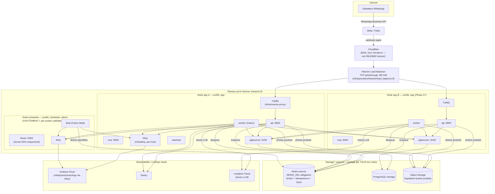

# Architecture — Déploiement Hetzner scalable

> Comment Ladini tourne aujourd'hui (Phase 1, MVP < 100 users, 1 node) et
> comment le même artefact ("BUILD ONCE / RUN EVERYWHERE",
> `docker-compose.prod.yml`) s'étend à plusieurs nodes Hetzner sans
> réécriture. Ce document décrit uniquement ce qui **existe réellement dans
> ce dépôt** — les pièces d'un autre chantier non encore livré sont
> explicitement marquées comme telles.

---

## Vue d'ensemble



*(Ce diagramme rend sur GitHub/GitLab — Mermaid nativement supporté. Aucun
autre doc du dépôt n'utilisait Mermaid au moment de l'écriture ; introduit
ici car un ASCII pur devenait illisible avec ce nombre de composants.)*

**Ce qui n'existe PAS encore dans ce dépôt et n'est donc pas dans le
diagramme comme "livré"** (vérifié par `ls` avant d'écrire ce document) :
Cloudflare lui-même n'est piloté par aucun Terraform ici (DNS pointé
manuellement vers `load_balancer_ipv4`, voir
`infra/providers/hetzner/README.md`) ; `infra/alloy/docker-compose.alloy.yml`
existe mais n'a pas encore de `.river` de config confirmé dans ce document
(vérifiez son contenu avant de le déployer tel quel).

---

## Composants réels de ce dépôt

| Composant | Fichier(s) | Rôle |
|---|---|---|
| Images applicatives | `infra/docker/Dockerfile.*`, poussées via CI vers `ghcr.io/${IMAGE_NAMESPACE}/ladini-{api,worker,mcp}:${RELEASE_VERSION}` | "Build once, run everywhere" — jamais `latest` en prod (`scripts/preflight.sh` refuse). |
| Compose applicatif | `docker-compose.prod.yml` | `api`, `worker`, `beat`, `mcp`, `pgbouncer`, `flower`, `autoheal` — un `profiles:` (`app`/`scheduler`/`admin`) par rôle de node. |
| Overlay dev | `docker-compose.dev.yml` | Ajoute un Redis LOCAL — **jamais** utilisé en production (`REDIS_URL` y est obligatoire sans défaut). |
| Reverse proxy | `infra/reverse-proxy/Caddyfile` | TLS auto (Let's Encrypt), n'expose publiquement QUE `/api/webhook/*`, `/health*`, `/version` — tout le reste 404. |
| Terraform Hetzner | `infra/providers/hetzner/*.tf` | `network.tf` (réseau privé), `firewall.tf` (default-deny, SSH restreint à `admin_cidrs`), `servers.tf`*(nodes app + scheduler optionnel)*, `placement.tf` (anti-affinité dès 2 nodes app), `variables.tf` (`app_node_count`, etc.). |
| Inventaire cluster | `infra/inventory.example.yml` → copié en `infra/inventory.yml` (gitignored) | Quel node porte quel(s) rôle(s) Compose. |
| Garde d'inventaire | `scripts/validate_inventory.py` | Refuse un inventaire avec 0 ou ≥2 `scheduler`, ou 0 `app`. |
| Déploiement 1 node | `scripts/node_deploy.sh` (et `scripts/deploy.sh`, wrapper legacy équivalent à `node_deploy.sh --single-node`) | lock → préflight → pull → migration → `up -d --profile <rôles>` → santé → `scripts/smoke.sh` → rollback auto si échec. |
| Déploiement cluster | `scripts/cluster_deploy.sh <release> [inventory]` | Pilote `node_deploy.sh` SUR CHAQUE node de l'inventaire (SSH), migrations DB une seule fois, verrou Redis cluster-wide, rolling, scheduler déployé en dernier. |
| Rollback cluster | `scripts/cluster_rollback.sh` | Symétrique de `cluster_deploy.sh`. |
| Observabilité par host | `infra/alloy/docker-compose.alloy.yml` | Grafana Alloy — scrape `/metrics`, reçoit OTLP (`:4317`/`:4318`), socket Docker via proxy read-only dédié. Cycle de vie indépendant du compose applicatif. |
| Smoke applicatif | `scripts/smoke.sh` | `/health/live`, `/version`, `/health/ready` (DB+Redis), MCP, Celery worker/beat, route webhook — gardé par rôle (`SMOKE_CHECK_APP`/`SCHEDULER`/`ADMIN`, positionné par `node_deploy.sh` selon les rôles réels du node). |
| Smoke observabilité | `scripts/smoke_observability.sh` | `/metrics` non vide, Alloy actif + port OTLP en écoute (tolérant si absent), vérif best-effort Grafana Cloud. |
| Métriques applicatives | `backend/src/ladini/core/telemetry.py` | `ladini_webhooks_received_total`, `ladini_http_requests_total`, `ladini_http_5xx_total`, `ladini_http_request_duration_seconds`, `ladini_llm_*`, etc. — voir le fichier pour la liste exhaustive. |
| Charge / capacité | `load-tests/*.js` + `load-tests/README.md` | k6 — webhook constant à 50/200/500 VUs, rampe de burst 10→500 VUs. |

---

## Mode normal (< 100 users, 1 node)

Un seul node Hetzner cumule les 3 rôles Compose (`app` + `scheduler` +
`admin`), comme documenté dans `infra/inventory.example.yml` et
`infra/providers/hetzner/environments/production.tfvars.example`
(`app_node_count = 1`). Le Load Balancer Hetzner est créé même à 1 node
(coût faible) — le DNS pointe déjà dessus, ce qui simplifie la bascule
Phase 2 sans re-pointer le DNS plus tard.

```
docker compose --profile app --profile scheduler --profile admin \
  -f docker-compose.prod.yml up -d
```

Toutes les connexions DB de ce node passent par son `pgbouncer` LOCAL vers
le Postgres managé EXTERNE. Redis est EXTERNE et partagé (obligatoire même à
1 node, `REDIS_URL` sans défaut dans `docker-compose.prod.yml`) — c'est ce
qui rend le passage à plusieurs nodes indolore : aucun état applicatif
(idempotence, verrous, broker Celery) n'est local à un node.

---

## Mode burst (~500 users concurrents)

Deux leviers, orthogonaux :

1. **Capacité worker sur les nodes existants** — augmenter
   `CELERY_WORKER_CONCURRENCY` (défaut `4`) et/ou
   `CELERY_WORKER_QUEUES`/`CELERY_WORKER_PREFETCH_MULTIPLIER`
   (`docker-compose.prod.yml`, service `worker`) : ce sont des variables
   d'env, pas un changement d'image — un redéploiement suffit. Voir
   `docs/runbooks/scaling.md`.
2. **Nombre de nodes app** — monter `app_node_count`
   (`infra/providers/hetzner/variables.tf`) : chaque nouveau node ajoute
   son propre `api`+`worker`+`mcp`+`pgbouncer` derrière le même Load
   Balancer. Voir `infra/providers/hetzner/README.md` §"Comment
   `app_node_count` scale" pour le détail Terraform (placement group forcé
   dès 2 nodes, budget `PGBOUNCER_DEFAULT_POOL_SIZE` à recalculer — voir la
   note dédiée en tête de `docker-compose.prod.yml` §"DIMENSIONNEMENT
   MULTI-NODE").

Le webhook ne fait qu'enqueuer (`process_agent_task.delay(...)`, voir
`backend/src/ladini/api/routes/twilio_webhook.py`/`whatsapp_webhook.py`) —
Celery + Redis (broker externe partagé) absorbent le pic pendant que les
workers rattrapent le retard ; c'est l'hypothèse vérifiée et testée dans
`load-tests/burst-scenario.js`. Un pic de 500 utilisateurs concurrents
n'exige donc PAS 500 requêtes HTTP traitées synchrone — il exige une
profondeur de file Celery qui absorbe temporairement, puis se vide au
rythme du débit worker réel (voir la checklist de métriques dans
`load-tests/README.md` pour savoir où lire cette profondeur).

---

## Procédure de déploiement

**1 node (legacy / Phase 1)** :
```bash
./scripts/deploy.sh <release>            # = node_deploy.sh <release> --single-node
```

**Cluster (Phase 2+, plusieurs nodes)** :
```bash
python scripts/validate_inventory.py infra/inventory.yml   # garde AVANT tout
./scripts/cluster_deploy.sh <release> infra/inventory.yml
```
`cluster_deploy.sh` appelle `node_deploy.sh <release> <rôles> --skip-migrate`
sur chaque node de l'inventaire (SSH, dans l'ordre, scheduler en dernier),
migrations DB faites UNE SEULE FOIS depuis l'orchestrateur, verrou Redis
cluster-wide (réutilise `REDIS_URL`, déjà partagé et obligatoire). Un échec
sur un node arrête le rollout — les nodes déjà à jour restent à jour, les
suivants ne sont pas touchés.

## Procédure de rollback

**1 node** : `./scripts/rollback.sh [release]` — voir
`docs/runbooks/rollback.md` (APP rollback seulement, jamais la DB — §43).

**Cluster** : `./scripts/cluster_rollback.sh` — symétrique de
`cluster_deploy.sh`.

---

## Scénarios de panne

| Panne | Effet observé | Comportement attendu |
|---|---|---|
| **Perte d'un node app** (parmi plusieurs) | Le Load Balancer Hetzner retire le node de la rotation dès l'échec de son health check ; le trafic continue sur les nodes app restants. Les tâches Celery déjà `.delay()`ées par CE node restent dans Redis (externe, partagé) — n'importe quel worker survivant peut les traiter. | Aucune action manuelle immédiate requise si ≥1 node app survit. Provisionner un remplaçant (`app_node_count` inchangé, juste recréer le server détruit) dès que possible pour retrouver la capacité nominale. |
| **Perte du node scheduler** | Celery Beat s'arrête : plus aucune tâche PLANIFIÉE (crons) ne se déclenche. Le trafic webhook/agent (chemin `app`) est **non affecté** — `beat` ne fait rien d'autre que planifier. | Redéployer un node `scheduler` (ou basculer `scheduler_on_dedicated_node` sur un node existant via `infra/inventory.yml` + `scripts/validate_inventory.py`, qui refuse tout inventaire à 0 ou ≥2 `scheduler`). Ne JAMAIS ajouter `scheduler` sur un 2e node "en attendant" — double-exécution des tâches planifiées (double notification, double réconciliation). |
| **Panne Redis externe** (broker + idempotence + locks) | Nouveaux webhooks : le check d'idempotence est FAIL-OPEN (voir `TWILIO_WEBHOOK_REDIS_ERROR`/`WHATSAPP_WEBHOOK_REDIS_ERROR` dans les routes webhook — le message est quand même traité, au risque d'un double-traitement si le message était un retry). L'enqueue Celery lui-même dépend de Redis (broker) — s'il échoue, `process_agent_task.delay()` lève une exception, capturée par le `try/except` englobant du handler webhook (`TWILIO_WEBHOOK_UNHANDLED_ERROR`/`WHATSAPP_WEBHOOK_UNHANDLED_ERROR`) → réponse TwiML vide/`EVENT_RECEIVED` renvoyée quand même (Twilio/Meta ne retentera pas indéfiniment sur la seule base d'un timeout HTTP côté Ladini). **Le message entrant est alors PERDU côté traitement agent.** Healthchecks `worker`/`beat` restent verts (ils sondent la LIVENESS du processus, pas le broker — voir le commentaire dédié dans `docker-compose.prod.yml`, évite un restart storm). `/health/ready` détecte la panne (composant `redis`) → 503, ce qui doit alerter (uptime monitoring externe sur cet endpoint, hors scope de ce dépôt). | Restaurer Redis (c'est un service managé externe — suivre la procédure du provider). Aucun rollback applicatif n'aide ici : le code n'est pas en cause. |
| **Panne Postgres managé** | `/health/ready` → composant `database` en erreur → 503. Toute écriture/lecture DB échoue côté `api`/`worker`/`mcp` (via `pgbouncer`, qui ne fait que multiplexer — il ne masque pas une panne du serveur cible). | Suivre le plan de reprise du provider managé (snapshots/PITR). Voir aussi `docs/runbooks/database-restore.md` pour la procédure de restauration applicative déjà documentée dans ce dépôt. |

---

## Ce qui reste HORS scope de ce document

- La configuration DNS Cloudflare elle-même (pas de Terraform Cloudflare
  dans ce dépôt à ce jour — DNS pointé manuellement, voir
  `infra/providers/hetzner/README.md`).
- Le contenu exact de la configuration Alloy (`*.river`) — vérifier
  `infra/alloy/` directement avant de s'y fier ; ce document ne décrit que
  le fait qu'un compose séparé existe et son rôle attendu (scrape
  `/metrics`, réception OTLP, cycle de vie indépendant de l'appli).
- Un dashboard Grafana Cloud pré-construit — non livré dans ce dépôt à ce
  jour.
